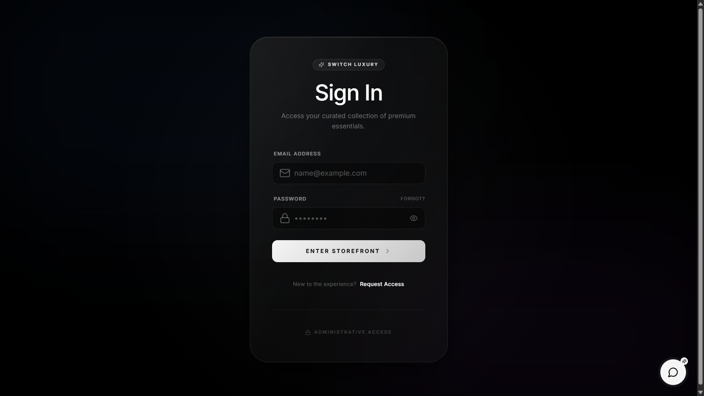
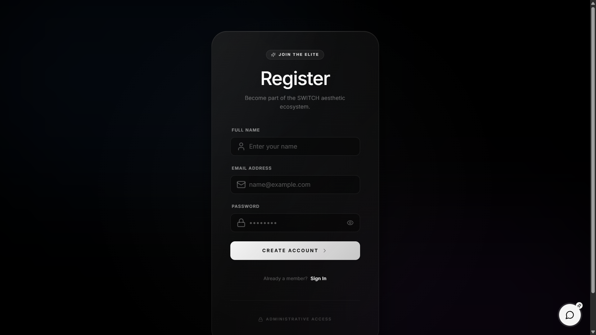
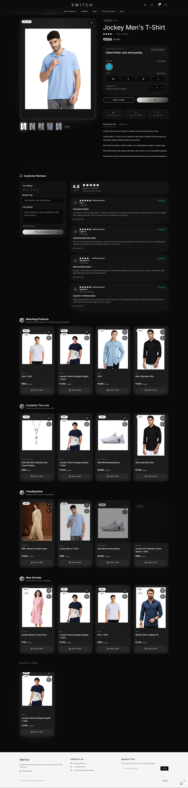
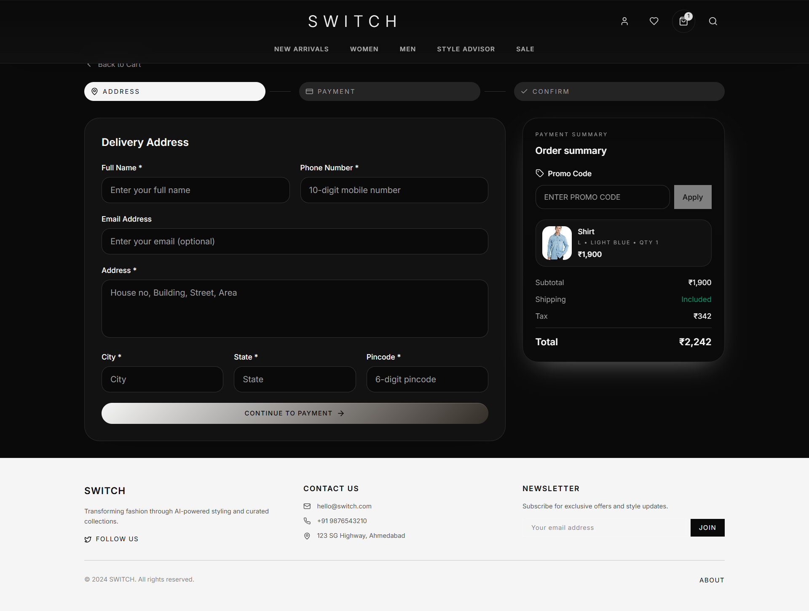
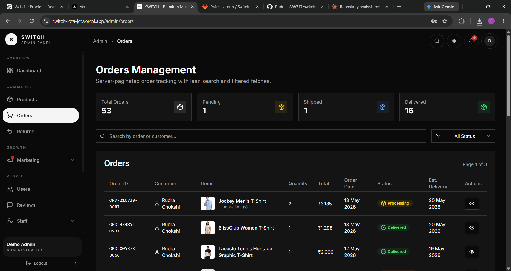
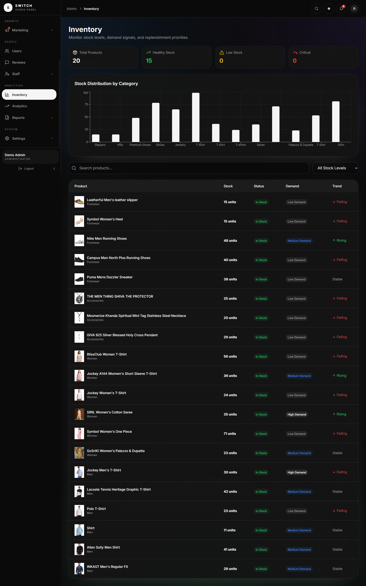

<div align="center">

<br/>


<br/><br/>

# SWITCH — Premium Modern Fashion E-Commerce

### *Adapt. Transform. Express.*

<br/>

[](https://switch-iota-jet.vercel.app)&nbsp;&nbsp;
[](https://react.dev)&nbsp;&nbsp;
[](https://www.typescriptlang.org)&nbsp;&nbsp;
[](https://supabase.com)

[](https://vitejs.dev)&nbsp;&nbsp;
[](https://tailwindcss.com)&nbsp;&nbsp;
[](https://vercel.com)&nbsp;&nbsp;
[](LICENSE)

<br/>

> **SWITCH** is a full-stack, production-ready fashion e-commerce platform built with modern web technologies.
> It features a cinematic dark-mode storefront, AI-powered style recommendations, a real-time admin dashboard
> with predictive analytics, a fully functional wallet system, real-time returns tracking, optimized checkout
> via a custom database function, and a CI/CD pipeline — all powered by React 18, TypeScript, Supabase & Tailwind CSS.

<br/>

[🚀 View Live Demo](https://switch-iota-jet.vercel.app) &nbsp;·&nbsp; [🐛 Report Bug](https://github.com/Rudraaa888747/switch/issues) &nbsp;·&nbsp; [✨ Request Feature](https://github.com/Rudraaa888747/switch/issues)

<br/>

</div>

---

<br/>

## 📌 Table of Contents

- [📸 Screenshots](#-screenshots)
- [✨ Features](#-features)
- [🛠️ Tech Stack](#️-tech-stack)
- [📂 Project Structure](#-project-structure)
- [🗄️ Database Schema](#️-database-schema)
- [⚙️ Getting Started](#️-getting-started)
- [📜 Available Scripts](#-available-scripts)
- [🚀 Deployment](#-deployment)
- [🔐 Environment Variables](#-environment-variables)
- [🤝 Contributing](#-contributing)
- [👨‍💻 Author](#-author)

<br/>

---

<br/>

## 📸 Screenshots

<br/>

### 🔐 Authentication — Cinematic UI

<div align="center">
  <table>
    <tr>
      <td align="center" width="50%">
        
        <br/><br/>
        <em>Sign In — "ENTER STOREFRONT" CTA · Glassmorphism card on ambient dark background · Administrative Access portal</em>
      </td>
      <td align="center" width="50%">
        
        <br/><br/>
        <em>Register — "JOIN THE ELITE" badge · "Become part of the SWITCH aesthetic ecosystem" · CREATE ACCOUNT flow</em>
      </td>
    </tr>
  </table>
</div>

<br/><br/>

---

<br/>

### 🏠 Homepage

<div align="center">
  
  <br/><br/>
  <em>"ENGINEERED FOR MODERN MOVEMENT" hero banner · New Arrivals & Matching Products grids · 14,551+ products · Newsletter subscription · Full dark-mode storefront</em>
</div>

<br/><br/>

---

<br/>

### 🧥 Product Detail Page

<div align="center">
  
  <br/><br/>
  <em>Image gallery · Size & colour selector · Quantity control · Customer reviews with verified badge · "You May Also Like" & "Trending Now" sections</em>
</div>

<br/><br/>

---

<br/>

### 🛒 Checkout — 3-Step Optimized Flow

<div align="center">
  
  <br/><br/>
  <em>3-step stepper: Address → Payment → Confirm · Promo code support · Live order summary with product thumbnails · Powered by <code>place_order_v2</code> custom DB function (3× faster than previous implementation)</em>
</div>

<br/><br/>

---

<br/>

### 👤 User Profile &nbsp;&nbsp;&nbsp;|&nbsp;&nbsp;&nbsp; 💰 My Wallet

<div align="center">
  <table>
    <tr>
      <td align="center" width="50%">
        
        <br/><br/>
        <em>GOLD tier badge · Orders / Wishlist / Addresses / Wallet stats · iOS-style pill tab slider (Orders · Profile · Wallet · Addresses · Settings)</em>
      </td>
      <td align="center" width="50%">
        
        <br/><br/>
        <em>Available balance · Full transaction history (Payments & Refunds) · Refunds auto-credited from approved returns · Filterable by transaction type</em>
      </td>
    </tr>
  </table>
</div>

<br/><br/>

---

<br/>

### 🔧 Admin Side

<br/>

#### 📊 Admin Dashboard — Live KPIs · Sales Chart · Predictive Insights

<div align="center">
  
  <br/><br/>
  <em>Real-time KPIs (Products +12% · Orders +8% · Revenue ₹1,63,236 +23% · Reviews +15%) · Monthly Sales Overview line chart · Category Distribution donut (Men/Women) · AI Predictive Insights (High Demand · Stock Alerts · Revenue Forecast) · Recent Orders feed · 🔔 9 Unread notifications</em>
</div>

<br/><br/>

---

<br/>

#### 🗂️ Orders Management &nbsp;&nbsp;&nbsp;|&nbsp;&nbsp;&nbsp; 📦 AI Smart Inventory

<div align="center">
  <table>
    <tr>
      <td align="center" width="50%">
        
        <br/><br/>
        <em>Server-paginated table (Page 1 of 3) · Status counters: Total 53 · Pending 1 · Shipped 1 · Delivered 16 · Search by order/customer · Status filter · Product thumbnails · Est. delivery dates</em>
      </td>
      <td align="center" width="50%">
        
        <br/><br/>
        <em>Stock Distribution bar chart by category · Per-product Stock / Status / Demand / Trend signals · High Demand · Medium Demand · Falling / Rising / Stable trend indicators · Stock level filter</em>
      </td>
    </tr>
  </table>
</div>

<br/>

---

<br/>

## ✨ Features

<br/>

### 🎭 UI/UX & Brand Identity

| Feature | Description |
|:---|:---|
| 🌑 **Cinematic Auth UI** | Luxury glassmorphism login & signup — "ENTER STOREFRONT" / "JOIN THE ELITE" — Apple × Prada aesthetic |
| 💊 **Profile Tab Pill Slider** | iOS segmented control-style animated pill that glides between Orders · Profile · Wallet · Addresses · Settings |
| ✨ **Glossy Dark Theme** | Ambient lighting effects, layered glass cards, and custom Tailwind animations (`fade-in`, `shimmer`, `pulse-soft`) across the entire storefront |
| 📱 **Fully Responsive** | Mobile-first design that renders correctly across all screen sizes |

<br/>

### 🛍️ Storefront — User Side

| Feature | Description |
|:---|:---|
| 🏠 **Homepage & Hero** | Full-page "ENGINEERED FOR MODERN MOVEMENT" hero · New Arrivals · Matching Products grid · 14,551+ catalogue |
| 🧥 **Product Detail** | Image gallery, size & colour selector, quantity control, Add to Cart / Buy Now |
| ⭐ **Customer Reviews** | Star ratings, verified-purchase badge, review submission form |
| 🔮 **You May Also Like** | Smart related product recommendations on every product page |
| ✨ **AI Style Advisor** | Upload photo → AI analyses features → personalised style profile with outfit recommendations |
| 👤 **User Profile Hub** | GOLD tier badge · manage orders, wishlist, saved addresses, wallet in one place |
| 💰 **Wallet System** | Available balance · full transaction history · refunds auto-credited from approved returns · usable at checkout |
| 📦 **Order Tracking** | Live status stepper: Order Placed → Processing → Shipped → Out for Delivery → Delivered |
| ↩️ **Return System** | Initiate returns with reason tagging; real-time tracker (Requested → Approved → Picked Up → Refunded) — updates instantly without page refresh |
| 🛒 **Optimized Checkout** | 3-step Address → Payment → Confirm flow powered by `place_order_v2` custom DB function — 3× faster than standard implementation |
| 💌 **Newsletter** | Email subscription for exclusive offers and style updates |

<br/>

### 🔧 Admin Panel

| Feature | Description |
|:---|:---|
| 📊 **Real-time Dashboard** | Live KPIs (Products · Orders · Revenue · Reviews) with growth % · `useMemo`-optimized stats |
| 🔔 **Notification System** | Instant bell notifications for new orders and return requests — no page refresh needed |
| 📈 **Sales Chart** | Interactive monthly revenue/profit line chart with area fill |
| 🍩 **Category Distribution** | Donut chart — Men · Women breakdown |
| 🤖 **Predictive Insights** | AI-driven High Demand alerts · Stock Warnings · Revenue Forecast cards |
| 📦 **AI Smart Inventory** | Stock Distribution by category · per-product Demand signals (High/Medium/Low) · Trend indicators (Rising/Falling/Stable) |
| 🗂️ **Orders Management** | Server-paginated table · search & status filter · product thumbnails · est. delivery dates |
| ↩️ **Return Management** | Full approval workflow — Approve · Reject · Mark Refunded — with reason tagging and real-time user sync |
| 🛍️ **Product Management** | Real-time inventory · stock level alerts · Add / Edit / Delete with category filtering |
| 👥 **User Management** | Customer accounts overview |
| ⭐ **Reviews Moderation** | View and moderate all customer reviews |

<br/>

---

<br/>

## 🛠️ Tech Stack

<br/>

<div align="center">

| Layer | Technology | Purpose |
|:---:|:---|:---|
| ⚛️ | **React 18 + TypeScript 5** | Frontend framework with full type safety (`any` types eliminated) |
| ⚡ | **Vite 5** | Lightning-fast build tool with manual chunk splitting (vendor · router · motion · supabase · ui) |
| 🎨 | **Tailwind CSS + tailwindcss-animate** | Utility-first styling with custom animations (fade-in, shimmer, pulse-soft) |
| 🧩 | **shadcn/ui + Radix UI** | Accessible, customisable UI primitives |
| 🔀 | **React Router DOM v6** | Client-side routing |
| 🔄 | **TanStack React Query v5** | Server state management, data fetching & cache |
| 📋 | **React Hook Form + Zod** | Form handling & schema validation |
| 🎞️ | **Framer Motion** | Page & component animations |
| 📊 | **Recharts** | Interactive charts & data visualisation |
| 🖋️ | **Inter (system font)** | Clean, modern typography |
| 🗄️ | **Supabase (PostgreSQL)** | Database with real-time subscriptions |
| 🔐 | **Supabase Auth** | JWT-based authentication + Row-Level Security |
| ☁️ | **Supabase Edge Functions** | Serverless backend business logic |
| 🔁 | **GitHub Actions + GitLab CI** | Automated build & test pipeline on every push |
| 🚀 | **Vercel** | Production deployment & global CDN hosting |

</div>

<br/>

---

<br/>

## 📂 Project Structure

```
switch/
│
├── 📁 src/
│   ├── 📁 components/
│   │   ├── 📁 admin/           # Admin dashboard components
│   │   ├── 📁 checkout/        # Cart & checkout flow
│   │   ├── 📁 products/        # Product cards, grids, filters
│   │   ├── 📁 reviews/         # Customer review components
│   │   ├── 📁 orders/          # Order tracking & history
│   │   └── 📁 ui/              # Base shadcn/ui components
│   │
│   ├── 📁 pages/               # Route-level page components
│   ├── 📁 contexts/            # React Context (Auth, Cart)
│   ├── 📁 hooks/               # Custom React hooks
│   ├── 📁 lib/                 # Utility functions & helpers
│   ├── 📁 integrations/        # Supabase client & typed queries
│   └── 📁 data/                # Static seed data & constants
│
├── 📁 supabase/
│   ├── 📁 migrations/          # SQL schema migrations (managed via Git LFS)
│   └── 📁 functions/           # Serverless Edge Functions
│
├── 📁 api/                     # API route handlers
├── 📁 public/                  # Static assets
├── 📁 Screenshots/             # Project screenshots for README
│
├── 📄 index.html
├── 📄 vite.config.ts           # Manual chunk splitting configured
├── 📄 tailwind.config.ts       # Custom animations & design tokens
├── 📄 vercel.json              # SPA routing config
└── 📄 package.json
```

<br/>

---

<br/>

## 🗄️ Database Schema

The project uses **Supabase (PostgreSQL)** with Row-Level Security (RLS) enforced on every table.

```
┌──────────────┐        ┌──────────────┐        ┌───────────────┐
│   profiles   │──────▶ │    orders    │──────▶  │  order_items  │
│   (users)    │        │              │         │               │
└──────────────┘        └──────────────┘         └───────────────┘
       │                       │                         │
       │                       ▼                         ▼
       │                ┌──────────────┐        ┌───────────────┐
       │                │   returns    │──────▶  │   products    │
       │                │              │         │               │
       │                └──────────────┘         └───────────────┘
       │                       │                         │
       ▼                       ▼                         ▼
┌──────────────┐        ┌──────────────┐        ┌───────────────┐
│  wishlists   │        │    wallet    │         │    reviews    │
│              │        │transactions  │         │               │
└──────────────┘        └──────────────┘         └───────────────┘
```

**Key design decisions:**
- 🔒 **RLS Policies** — Users can only read/write their own orders, returns, wallet, and profile data
- 👑 **Admin Role** — Separate admin flag in `profiles` with elevated RLS permissions for full store access
- ⚡ **Real-time** — Supabase Realtime subscriptions power live order status and return workflow updates
- 🚀 **`place_order_v2`** — Custom PostgreSQL function that handles the entire order placement in a single atomic DB call (3× faster checkout)
- ☁️ **Edge Functions** — Complex business logic (return approvals, wallet credits, stock updates) runs serverlessly

<br/>

---

<br/>

## ⚙️ Getting Started

<br/>

### Prerequisites

- **Node.js** v18 or higher → [Download](https://nodejs.org/)
- **npm** or **bun** package manager
- A **[Supabase](https://supabase.com)** project (free tier works perfectly)
- **Git LFS** installed (required for the migration file) → [Install](https://git-lfs.com/)

<br/>

### 1 — Clone the Repository

```bash
git clone https://github.com/Rudraaa888747/switch.git
cd switch
```

### 2 — Install Dependencies

```bash
npm install
```

### 3 — Configure Environment Variables

Create a `.env` file in the root directory:

```env
VITE_SUPABASE_URL=https://your-project.supabase.co
VITE_SUPABASE_PUBLISHABLE_KEY=your-anon-public-key
VITE_SUPABASE_PROJECT_ID=your-project-id
```

> 💡 Get these values from your Supabase project → **Settings → API**

### 4 — Set Up the Database

```bash
# Option A — Using Supabase CLI
supabase db push

# Option B — Manual
# Open supabase/migrations/consolidated_migration.sql
# Run it in your Supabase SQL Editor
# Note: this file is stored in Git LFS — ensure git-lfs is installed before cloning
```

### 5 — Start the Development Server

```bash
npm run dev
```

Open [http://localhost:8080](http://localhost:8080) — you're live! 🎉

<br/>

---

<br/>

## 📜 Available Scripts

```bash
npm run dev          # 🔥 Start dev server with hot reload  →  localhost:8080
npm run build        # 📦 Production build (with manual chunk splitting)
npm run build:dev    # 🔧 Development mode build
npm run preview      # 👁️  Preview production build locally
npm run lint         # ✅ Run ESLint code quality checks
```

<br/>

---

<br/>

## 🚀 Deployment

<br/>

### ▲ Deploy to Vercel (Recommended)

```bash
# Install Vercel CLI
npm i -g vercel

# Deploy to production
vercel --prod
```

Or connect your GitHub repo directly on [vercel.com](https://vercel.com) — Vite is auto-detected.

Add these in your Vercel dashboard under **Settings → Environment Variables:**

```
VITE_SUPABASE_URL
VITE_SUPABASE_PUBLISHABLE_KEY
VITE_SUPABASE_PROJECT_ID
```

<br/>

### 🌐 Deploy to Netlify

```
Build command   →   npm run build
Publish dir     →   dist
```

Add the same environment variables in **Netlify → Site Settings → Environment Variables.**

<br/>

---

<br/>

## 🔐 Environment Variables

| Variable | Description | Required |
|:---|:---|:---:|
| `VITE_SUPABASE_URL` | Your Supabase project URL | ✅ |
| `VITE_SUPABASE_PUBLISHABLE_KEY` | Supabase anon / public key | ✅ |
| `VITE_SUPABASE_PROJECT_ID` | Your Supabase project ID | ✅ |

> ⚠️ **Never commit your `.env` file.** It is already listed in `.gitignore`.

<br/>

---

<br/>

## 🤝 Contributing

Contributions are always welcome!

```bash
# 1. Fork the repository

# 2. Create your feature branch
git checkout -b feature/amazing-feature

# 3. Commit your changes  (conventional commits preferred)
git commit -m "feat: add amazing feature"

# 4. Push to your branch
git push origin feature/amazing-feature

# 5. Open a Pull Request 🎉
```

<br/>

---

<br/>

## 👨‍💻 Author

<br/>

<div align="center">

### Rudra Chokshi

*Full-Stack Developer · Fashion Tech Enthusiast*

<br/>

[](https://www.linkedin.com/in/rudra-chokshi-630004374/)&nbsp;&nbsp;
[](https://github.com/Rudraaa888747)&nbsp;&nbsp;
[](https://switch-iota-jet.vercel.app)

</div>

<br/>

---

<br/>

<div align="center">

Built with ❤️ using &nbsp;**React** · **TypeScript** · **Supabase** · **Tailwind CSS**

<br/>

**⭐ &nbsp; If this project impressed you, please consider giving it a star! &nbsp; ⭐**

<br/>


</div>
