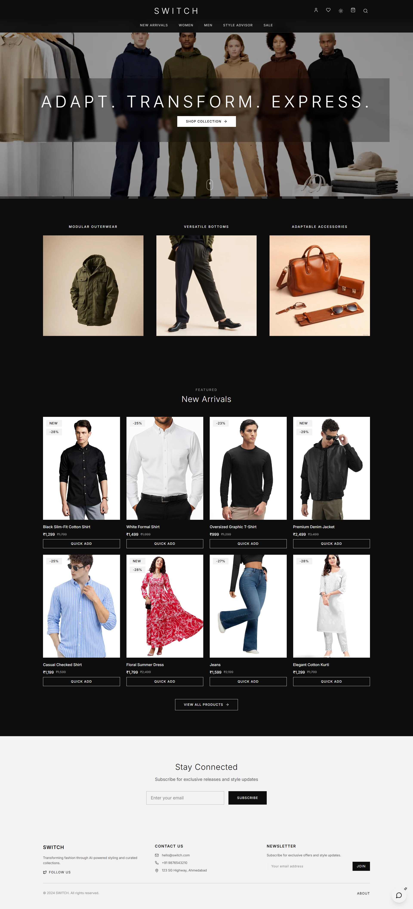

<<<<<<< HEAD
# Switch
=======
<div align="center">

<br/>


<br/><br/>

# SWITCH — Premium Modern Fashion E-Commerce

### *Adapt. Transform. Express.*

<br/>

[](https://switch-iota-jet.vercel.app)&nbsp;&nbsp;
[](https://react.dev)&nbsp;&nbsp;
[](https://www.typescriptlang.org)&nbsp;&nbsp;
[](https://supabase.com)

[](https://vitejs.dev)&nbsp;&nbsp;
[](https://tailwindcss.com)&nbsp;&nbsp;
[](https://vercel.com)&nbsp;&nbsp;
[](LICENSE)

<br/>

> **SWITCH** is a full-stack, production-ready fashion e-commerce platform built from scratch.
> It features a complete storefront, AI-powered style recommendations, a real-time admin dashboard
> with predictive analytics, full order & return lifecycle management, and a sleek dark-mode UI —
> all powered by React 18, TypeScript, Supabase & Tailwind CSS.

<br/>

[🚀 View Live Demo](https://switch-iota-jet.vercel.app) &nbsp;·&nbsp; [🐛 Report Bug](https://github.com/Rudraaa888747/switch/issues) &nbsp;·&nbsp; [✨ Request Feature](https://github.com/Rudraaa888747/switch/issues)

<br/>

</div>

---

<br/>

## 📌 Table of Contents

- [📸 Screenshots](#-screenshots)
- [✨ Features](#-features)
- [🛠️ Tech Stack](#️-tech-stack)
- [📂 Project Structure](#-project-structure)
- [🗄️ Database Schema](#️-database-schema)
- [⚙️ Getting Started](#️-getting-started)
- [📜 Available Scripts](#-available-scripts)
- [🚀 Deployment](#-deployment)
- [🔐 Environment Variables](#-environment-variables)
- [🤝 Contributing](#-contributing)
- [👨‍💻 Author](#-author)

<br/>

---

<br/>

## 📸 Screenshots

<br/>

### 🛍️ User Side

<br/>

#### 🏠 Homepage

<div align="center">
  
  <br/><br/>
  <em>Full-page hero banner with "Adapt. Transform. Express." tagline · Curated New Arrivals grid · Category navigation · Newsletter subscription</em>
</div>

<br/><br/>

---

<br/>

#### 🧥 Product Detail Page

<div align="center">
  
  <br/><br/>
  <em>Image gallery · Size & colour selector · Quantity control · Customer reviews with verified badge · "You May Also Like" & "Trending Now" sections</em>
</div>

<br/><br/>

---

<br/>

#### ✨ AI Style Advisor

<div align="center">
  
  <br/><br/>
  <em>Upload your photo — AI analyses your unique features and builds a personalised style profile with curated outfit recommendations</em>
</div>

<br/><br/>

---

<br/>

#### 👤 User Profile &nbsp;&nbsp;&nbsp;|&nbsp;&nbsp;&nbsp; 📦 My Orders & Return Tracking

<div align="center">
  <table>
    <tr>
      <td align="center" width="50%">
        
        <br/><br/>
        <em>Orders · Wishlist · Saved Addresses · Payment Cards — all in one clean profile hub</em>
      </td>
      <td align="center" width="50%">
        
        <br/><br/>
        <em>Full order history with live status stepper · Return-progress tracker (Requested → Approved → Picked Up → Refunded)</em>
      </td>
    </tr>
  </table>
</div>

<br/><br/>

---

<br/>

### 🔧 Admin Side

<br/>

#### 📊 Admin Dashboard — Live KPIs · Sales Chart · Predictive Insights

<div align="center">
  
  <br/><br/>
  <em>Real-time KPIs (Products · Orders · Revenue · Reviews) · Monthly Sales Overview chart · Category Distribution donut · AI-driven Predictive Insights panel</em>
</div>

<br/><br/>

---

<br/>

#### 📈 Analytics &nbsp;&nbsp;&nbsp;|&nbsp;&nbsp;&nbsp; 🗂️ Orders Management

<div align="center">
  <table>
    <tr>
      <td align="center" width="50%">
        
        <br/><br/>
        <em>Monthly revenue trends · Avg Order Value · Conversion Rate · Revenue Forecast · Peak Sales Period · Best-Selling Products leaderboard</em>
      </td>
      <td align="center" width="50%">
        
        <br/><br/>
        <em>Server-paginated order table · Search & status filter · Product thumbnails · Customer info · Estimated delivery dates</em>
      </td>
    </tr>
  </table>
</div>

<br/><br/>

---

<br/>

#### ↩️ Return Management &nbsp;&nbsp;&nbsp;|&nbsp;&nbsp;&nbsp; 🛍️ Product Management

<div align="center">
  <table>
    <tr>
      <td align="center" width="50%">
        
        <br/><br/>
        <em>Full returns workflow — View · Approve · Reject · Refund — with reason tagging (Not as Expected · Defective · Damaged) and status badges</em>
      </td>
      <td align="center" width="50%">
        
        <br/><br/>
        <em>Real-time inventory · Stock level indicators (In Stock · Medium · Low Stock) · Category filter · Inline Edit & Delete</em>
      </td>
    </tr>
  </table>
</div>

<br/>

---

<br/>

## ✨ Features

<br/>

### 🛍️ Storefront — User Side

| Feature | Description |
|:---|:---|
| 🏠 **Homepage & Hero** | Full-page hero with "Adapt. Transform. Express." tagline, New Arrivals grid, category banners |
| 🧥 **Product Detail** | Image gallery, size & colour selector, quantity control, Add to Cart / Buy Now |
| ⭐ **Customer Reviews** | Star ratings, verified-purchase badge, review submission form |
| 🔮 **You May Also Like** | Smart related product recommendations on every product page |
| ✨ **AI Style Advisor** | Upload photo → AI analyses features → personalised style profile with outfit recommendations |
| 👤 **User Profile Hub** | Manage orders, wishlist, saved addresses, and payment cards in one place |
| 📦 **Order Tracking** | Live status stepper: Order Placed → Processing → Shipped → Out for Delivery → Delivered |
| ↩️ **Return System** | Initiate returns with reason tagging; real-time tracker: Requested → Approved → Picked Up → Refunded |
| 💌 **Newsletter** | Email subscription for exclusive offers and style updates |

<br/>

### 🔧 Admin Panel

| Feature | Description |
|:---|:---|
| 📊 **Dashboard** | Live KPIs — Total Products, Orders, Revenue, Reviews — with growth trend percentages |
| 📈 **Sales Chart** | Interactive monthly revenue line chart with area fill |
| 🍩 **Category Distribution** | Donut chart breakdown — Shirts · Pants · Dresses · Jackets · Accessories |
| 🤖 **Predictive Insights** | AI-driven High Demand alerts, Stock Warnings, and Revenue Forecast cards |
| 📉 **Analytics Page** | Monthly revenue, Avg Order Value, Conversion Rate, Best-Selling Products leaderboard |
| 🗂️ **Orders Management** | Server-paginated table with search, status filter, product thumbnails, est. delivery |
| ↩️ **Return Management** | Full approval workflow — Approve · Reject · Mark Refunded — with reason & status badges |
| 🛍️ **Product Management** | Real-time inventory, stock level alerts, Add / Edit / Delete with category filtering |
| 👥 **User Management** | Customer accounts overview |
| ⭐ **Reviews Moderation** | View and moderate all customer reviews |
| 📦 **Inventory Tracking** | Stock-level monitoring with low stock and restock alerts |

<br/>

---

<br/>

## 🛠️ Tech Stack

<br/>

<div align="center">

| Layer | Technology | Purpose |
|:---:|:---|:---|
| ⚛️ | **React 18 + TypeScript** | Frontend framework with full type safety |
| ⚡ | **Vite 5** | Lightning-fast build tool & dev server |
| 🎨 | **Tailwind CSS + tailwindcss-animate** | Utility-first styling & smooth animations |
| 🧩 | **shadcn/ui + Radix UI** | Accessible, customisable UI primitives |
| 🔀 | **React Router DOM v6** | Client-side routing |
| 🔄 | **TanStack React Query v5** | Server state management & data fetching |
| 📋 | **React Hook Form + Zod** | Form handling & schema validation |
| 🎞️ | **Framer Motion** | Page & component animations |
| 📊 | **Recharts** | Interactive charts & data visualisation |
| 🗄️ | **Supabase (PostgreSQL)** | Database with real-time subscriptions |
| 🔐 | **Supabase Auth** | JWT-based authentication + Row-Level Security |
| ☁️ | **Supabase Edge Functions** | Serverless backend business logic |
| 🖋️ | **Poppins (@fontsource)** | Premium typography |
| 🚀 | **Vercel** | Production deployment & global CDN hosting |

</div>

<br/>

---

<br/>

## 📂 Project Structure

```
switch/
│
├── 📁 src/
│   ├── 📁 components/
│   │   ├── 📁 admin/           # Admin dashboard components
│   │   ├── 📁 checkout/        # Cart & checkout flow
│   │   ├── 📁 products/        # Product cards, grids, filters
│   │   ├── 📁 reviews/         # Customer review components
│   │   ├── 📁 orders/          # Order tracking & history
│   │   └── 📁 ui/              # Base shadcn/ui components
│   │
│   ├── 📁 pages/               # Route-level page components
│   ├── 📁 contexts/            # React Context (Auth, Cart)
│   ├── 📁 hooks/               # Custom React hooks
│   ├── 📁 lib/                 # Utility functions & helpers
│   ├── 📁 integrations/        # Supabase client & typed queries
│   └── 📁 data/                # Static seed data & constants
│
├── 📁 supabase/
│   ├── 📁 migrations/          # SQL database schema migrations
│   └── 📁 functions/           # Serverless Edge Functions
│
├── 📁 api/                     # API route handlers
├── 📁 public/                  # Static assets
├── 📁 Screenshots/             # Project screenshots for README
│
├── 📄 index.html
├── 📄 vite.config.ts
├── 📄 tailwind.config.ts
├── 📄 vercel.json
└── 📄 package.json
```

<br/>

---

<br/>

## 🗄️ Database Schema

The project uses **Supabase (PostgreSQL)** with Row-Level Security (RLS) enforced on every table.

```
┌──────────────┐        ┌──────────────┐        ┌───────────────┐
│   profiles   │──────▶ │    orders    │──────▶  │  order_items  │
│   (users)    │        │              │         │               │
└──────────────┘        └──────────────┘         └───────────────┘
       │                       │                         │
       │                       ▼                         ▼
       │                ┌──────────────┐        ┌───────────────┐
       │                │   returns    │──────▶  │   products    │
       │                │              │         │               │
       │                └──────────────┘         └───────────────┘
       │                                                 │
       ▼                                                 ▼
┌──────────────┐                                ┌───────────────┐
│  wishlists   │                                │    reviews    │
│              │                                │               │
└──────────────┘                                └───────────────┘
```

**Key design decisions:**
- 🔒 **RLS Policies** — Users can only read/write their own orders, returns, and profile data
- 👑 **Admin Role** — Separate admin flag in `profiles` with elevated RLS permissions for full store access
- ⚡ **Real-time** — Supabase Realtime subscriptions power live order status updates
- ☁️ **Edge Functions** — Complex business logic (return approvals, stock updates) runs serverlessly

<br/>

---

<br/>

## ⚙️ Getting Started

<br/>

### Prerequisites

- **Node.js** v18 or higher → [Download](https://nodejs.org/)
- **npm** or **bun** package manager
- A **[Supabase](https://supabase.com)** project (free tier works perfectly)

<br/>

### 1 — Clone the Repository

```bash
git clone https://github.com/Rudraaa888747/switch.git
cd switch
```

### 2 — Install Dependencies

```bash
npm install
```

### 3 — Configure Environment Variables

Create a `.env` file in the root directory:

```env
VITE_SUPABASE_URL=https://your-project.supabase.co
VITE_SUPABASE_PUBLISHABLE_KEY=your-anon-public-key
VITE_SUPABASE_PROJECT_ID=your-project-id
```

> 💡 Get these values from your Supabase project → **Settings → API**

### 4 — Set Up the Database

```bash
# Option A — Using Supabase CLI
supabase db push

# Option B — Manual
# Open consolidated_migration.sql → run it in your Supabase SQL Editor
```

### 5 — Start the Development Server

```bash
npm run dev
```

Open [http://localhost:8080](http://localhost:8080) — you're live! 🎉

<br/>

---

<br/>

## 📜 Available Scripts

```bash
npm run dev          # 🔥 Start dev server with hot reload  →  localhost:8080
npm run build        # 📦 Production build
npm run build:dev    # 🔧 Development mode build
npm run preview      # 👁️  Preview production build locally
npm run lint         # ✅ Run ESLint code quality checks
```

<br/>

---

<br/>

## 🚀 Deployment

<br/>

### ▲ Deploy to Vercel (Recommended)

```bash
# Install Vercel CLI
npm i -g vercel

# Deploy to production
vercel --prod
```

Or connect your GitHub repo directly on [vercel.com](https://vercel.com) — Vite is auto-detected.

Add these in your Vercel dashboard under **Settings → Environment Variables:**

```
VITE_SUPABASE_URL
VITE_SUPABASE_PUBLISHABLE_KEY
VITE_SUPABASE_PROJECT_ID
```

<br/>

### 🌐 Deploy to Netlify

```
Build command   →   npm run build
Publish dir     →   dist
```

Add the same environment variables in **Netlify → Site Settings → Environment Variables.**

<br/>

---

<br/>

## 🔐 Environment Variables

| Variable | Description | Required |
|:---|:---|:---:|
| `VITE_SUPABASE_URL` | Your Supabase project URL | ✅ |
| `VITE_SUPABASE_PUBLISHABLE_KEY` | Supabase anon / public key | ✅ |
| `VITE_SUPABASE_PROJECT_ID` | Your Supabase project ID | ✅ |

> ⚠️ **Never commit your `.env` file.** It is already listed in `.gitignore`.

<br/>

---

<br/>

## 🤝 Contributing

Contributions are always welcome!

```bash
# 1. Fork the repository

# 2. Create your feature branch
git checkout -b feature/amazing-feature

# 3. Commit your changes  (conventional commits preferred)
git commit -m "feat: add amazing feature"

# 4. Push to your branch
git push origin feature/amazing-feature

# 5. Open a Pull Request 🎉
```

<br/>

---

<br/>

## 👨‍💻 Author

<br/>

<div align="center">

### Rudra Chokshi

*Full-Stack Developer · Fashion Tech Enthusiast*

<br/>

[](https://www.linkedin.com/in/rudra-chokshi-630004374/)&nbsp;&nbsp;
[](https://github.com/Rudraaa888747)&nbsp;&nbsp;
[](https://switch-iota-jet.vercel.app)

</div>

<br/>

---

<br/>

<div align="center">

Built with ❤️ using &nbsp;**React** · **TypeScript** · **Supabase** · **Tailwind CSS**

<br/>

**⭐ &nbsp; If this project impressed you, please consider giving it a star! &nbsp; ⭐**

<br/>


</div>
>>>>>>> 700dad1 (Initial clean commit)
